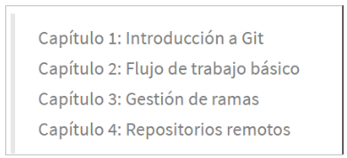

# Ejercicios de creación y actualización de repositorios

## Ejercicio 1

1. Crear un repositorio nuevo con el nombre libro y mostrar su contenido.
2. Configurar Git definiendo el nombre del usuario, el correo electrónico y activar el coloreado de la salida. Mostrar la configuración final.

    ~~~
    Creamos el repositorio con nombre libro:
    git init libro
    Definimos el nombre del usuario:
    git config --global user.name "Your-Full-Name"
    Definimos el correo electrónico:
    git config --global user.email "your-email-address
    Activamos el coloreado:
    git colores.ui
    Mostrar configuración final:
    git config --list
    ~~~

## Ejercicio 2

1. Comprobar el estado del repositorio.
2. Crear un fichero indice.txt con el siguiente contenido:
   
    

1. Comprobar de nuevo el estado del repositorio.
2. Añadir el fichero a la zona de intercambio temporal.
3. Volver a comprobar una vez más el estado del repositorio.

    ~~~
    git status
    Se crea el fichero indice.txt con su contenido
    git status
    git add indice.txt
    git status
    ~~~

## Ejercicio 3

Realizar un commit de los últimos cambios con el mensaje “Añadido índice del libro.” y ver el estado del repositorio.

    ~~~
    git commit -m "Añadido índice del libro"
    git status
    ~~~

## Ejercicio 4

1. Cambiar el fichero indice.txt para que contenga lo siguiente:

    

 
2. Mostrar los cambios con respecto a la última versión guardada en el repositorio.
3. Hacer un commit de los cambios con el mensaje “Añadido capítulo 3 sobre gestión de ramas”.

    ~~~
    git status
    git commit -m "Añadido capítulo 3 sobre gestión de ramas"
    ~~~

## Ejercicio 5

1. Mostrar los cambios de la última versión del repositorio con respecto a la anterior.
2. Cambiar el mensaje del último commit por “Añadido capítulo 3 sobre gestión de ramas al índice.”
3. Volver a mostrar los últimos cambios del repositorio.

    ~~~
    git status
    git commit --amend -m "Añadido capítulo 3 sobre gestión de ramas al índice." 
    git status
    ~~~

## Ejercicio 6

Indica a Git que quieres que ignore todos los ficheros que empiecen per “dam”, todos los que 
tengan la extensión out y las imágenes (jpg, png, bmp y gif). 

    ~~~
    Creamos un archivo .gitignore
    Dentro de el indicamos que queremos que ignore:
    dam*
    *.jpg
    *.png
    *.bmp
    *.gif
    Luego lo subimos a nuestro repositorio:
    git add .gitignore
    git commit -m "Añadido archivo para ignorar files"
    git push
    Y de esta forma, todos los tipos de archivos que le hemos indicado seran ignorados
    ~~~

