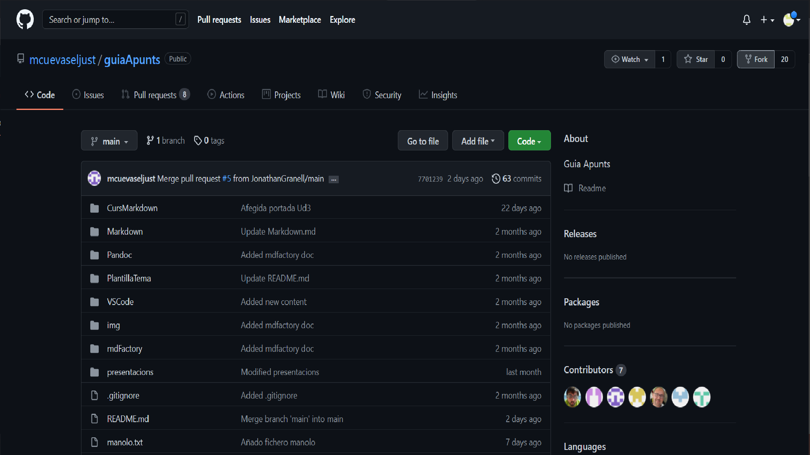
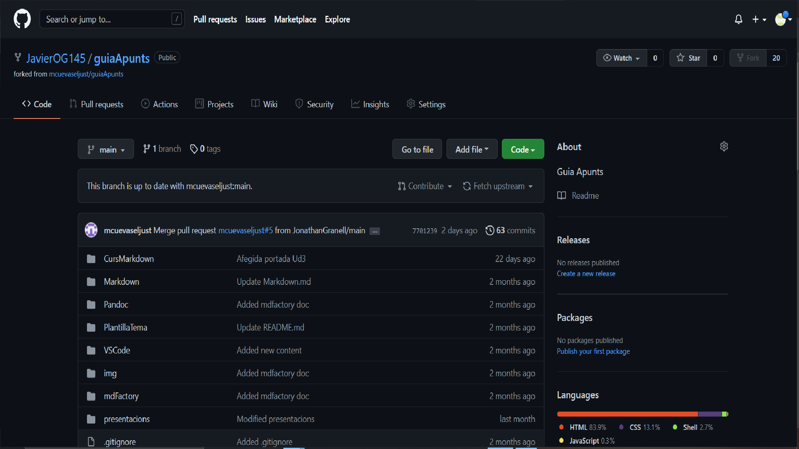
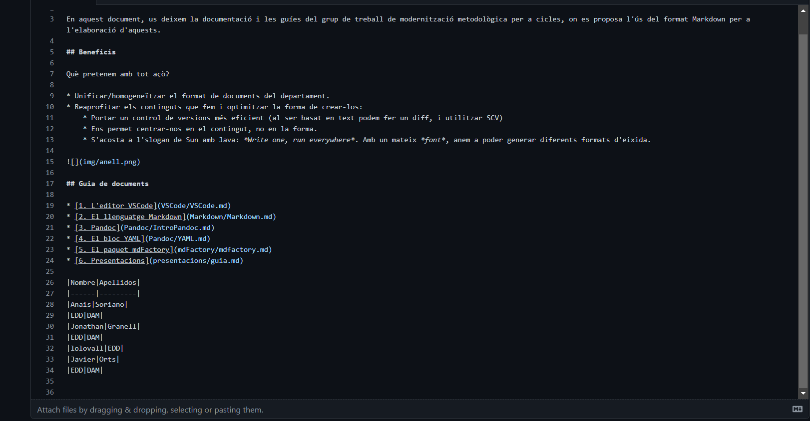
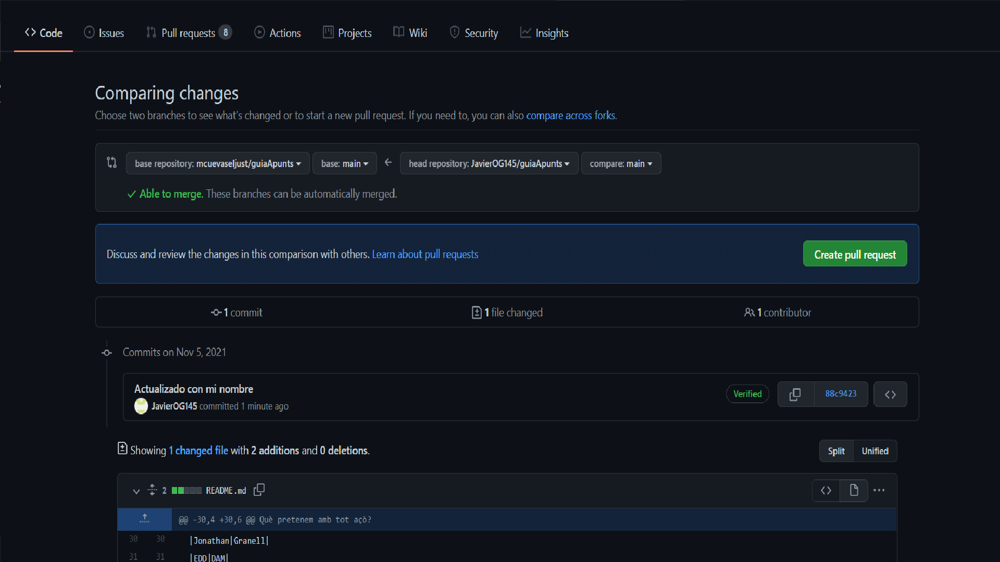
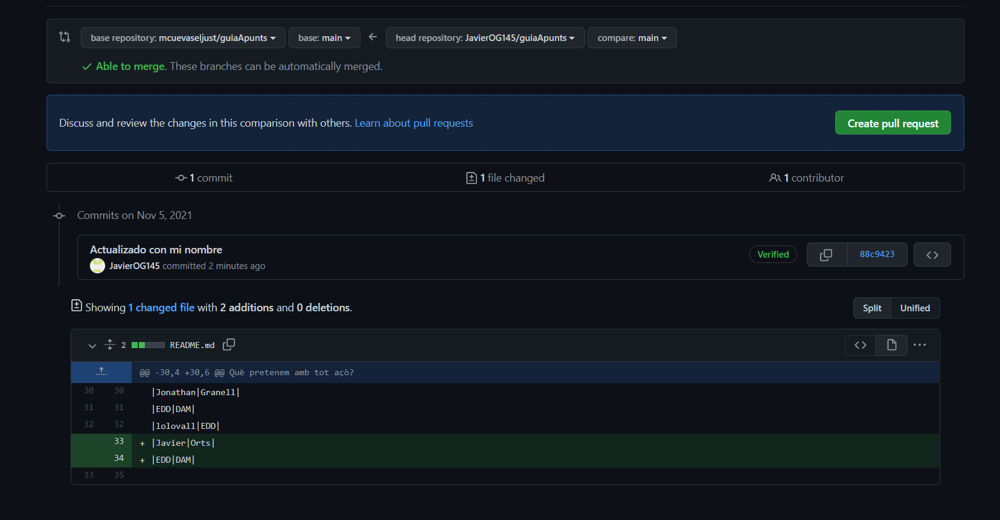

# Ejercicios de repositorios remotos

Para hacer estos ejercicios es necesario haber hecho antes los ejercicios sobre ramas.

## Ejercicio 1

1. Crear un nuevo repositorio público en GitHub con el nombre **libro-git**.
2. Añadirlo al repositorio local del libro.
3. Mostrar todos los repositorios remotos configurados.

~~~git
solución
~~~

## Ejercicio 2

1. Añadir los cambios del repositorio local al repositorio remoto de GitHub.
2. Acceder a GitHub y comprobar que se han subido los cambios mostrando el historial de versiones.

~~~git
solución
~~~

## Ejercicio 3

1. Colaborar en el repositorio remoto **libro-git** de otro usuario.
2. Clonar su repositorio **libro-git (mcuevaseljust)**.
3. Añadir el fichero **autores.txt** que contenga el nombre del usuario y su correo electrónico.
4. Añadir los cambios a la zona de intercambio temporal.
5. Hacer un commit con el mensaje “Añadido autor.”
6. Subir los cambios al repositorio remoto.

~~~git
solución
~~~

## Ejercicio 4

1. Desde vuestra cuenta de GitHub, realizad un «Fork» del repositorio https://github.com/mcuevaseljust/guiaApunts.git.
2. Modificad el fichero README.md, añadiendo vuestro nombre en la tabla.
3. Haced un «Pull request» para contribuir en el repositorio de «mcuevaseljust», podéis dejar un comentario.

Nota: En este ejercicio, deberéis enviar capturas de los pasos que vayáis llevando a cabo.
Fotos:
~~~
    
    
    
    
    
~~~

## Ejercicio 5

1. Clonar el repositorio **mcuevaseljust/EjerciciosGit**
2. Crea un repositorio en tu cuenta de GitHub, y sube el repositorio clonado con las soluciones de los diferentes ejercicios.
3. Modifica el fichero README.md, indicando tu nombre e indica la dirección del repositorio.

~~~
https://github.com/JavierOG145/EDD_Ejercicios.git
~~~